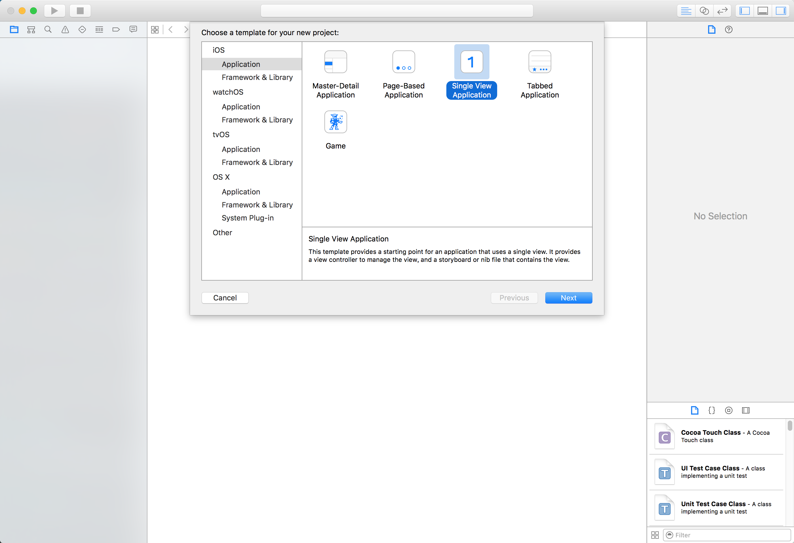
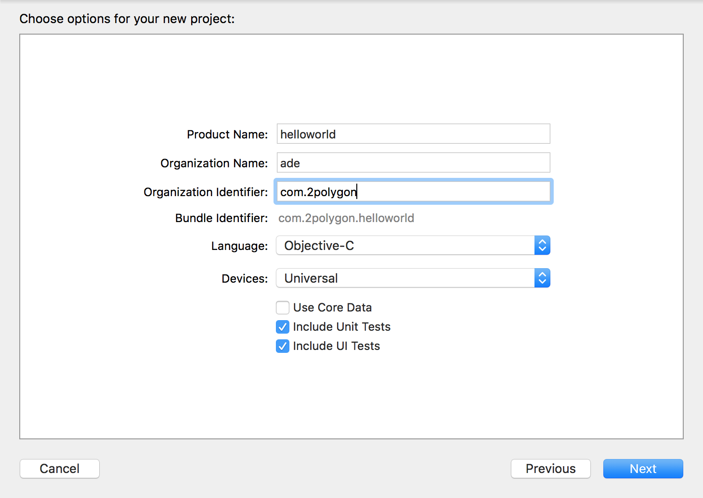
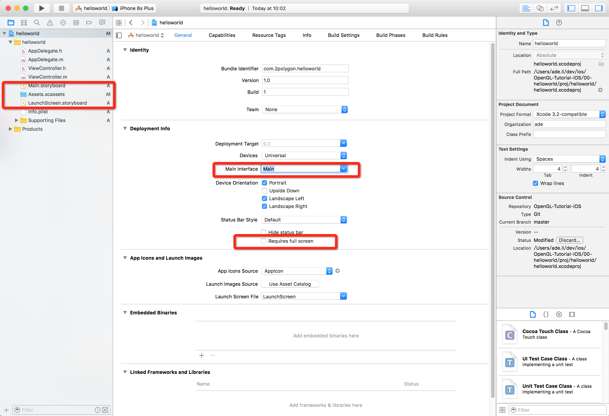
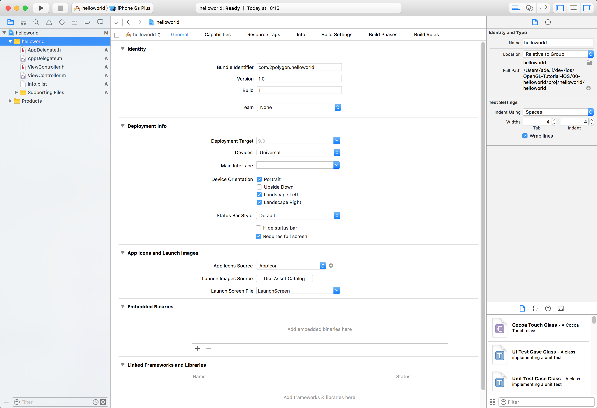
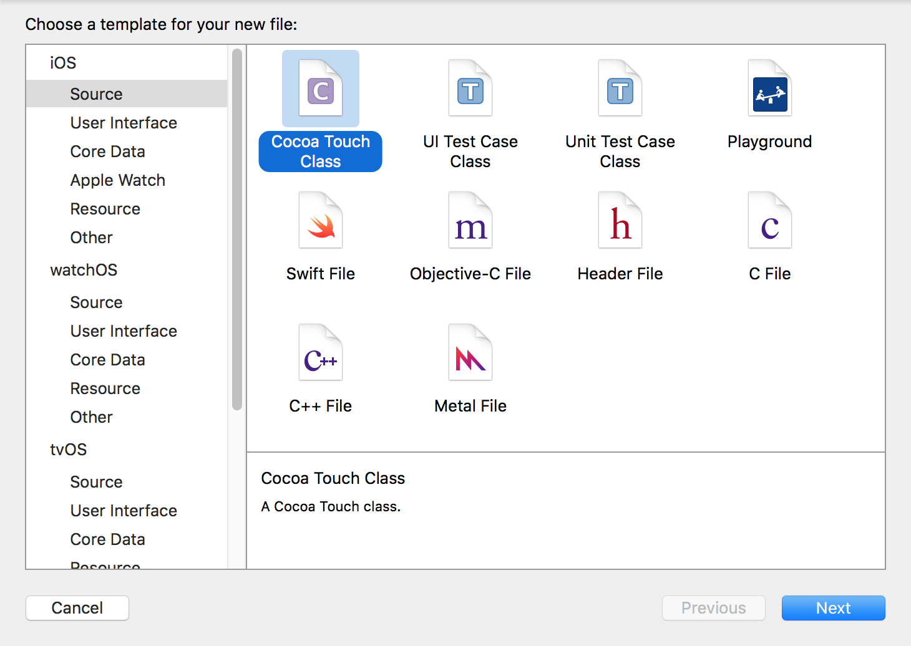
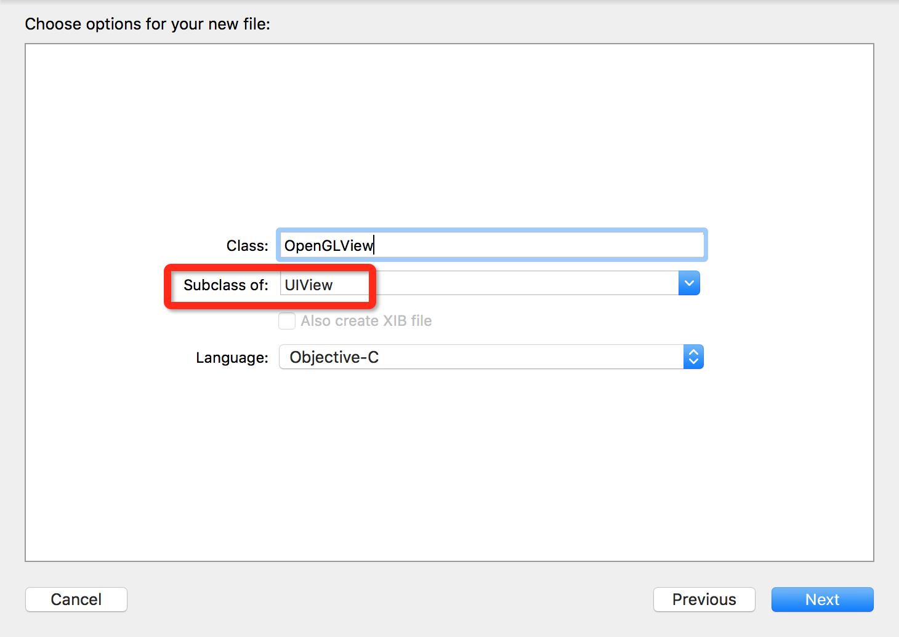
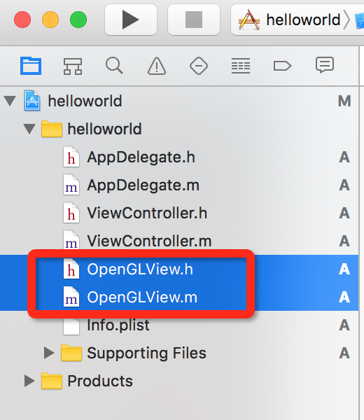
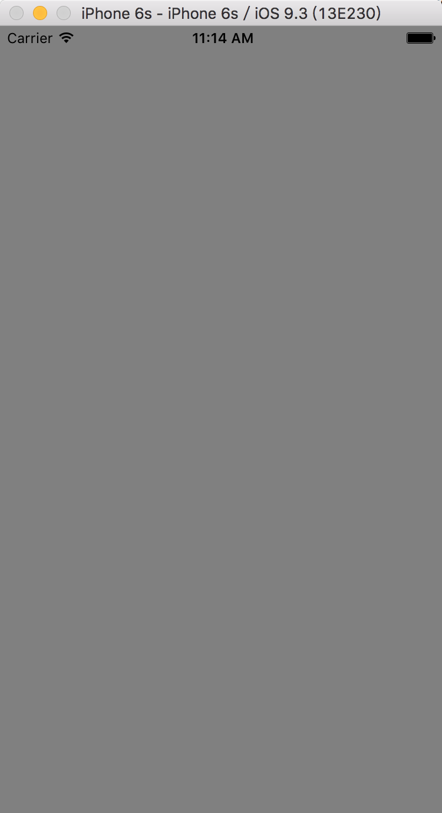

#HelloWorld

## 创建项目

### 1. 创建项目


创建一个Single View Application

### 2. 填写项目信息


项目信息

### 3. 删除不需要的文件


红色相框部分需要更改。
a) 删除Main.storyboard/Assets.xcassets/LaunchScreen.storyboard
b) Main Interface文本框中内容删除
c) Requires full screen需要勾选(不勾选也不影响，但会有一个警告，而且如果上架App Store有可能审核不通过)

### 0x03 创建项目结束


## 代码实战

### 1. 创建OpenGLView


选择Cocoa Touch Class



OpenGLView继承于UIView



需要将<b>OpenGLView.m</b>改成<b>OpenGLView.mm</b>

### 2. OpenGLView

#### OpenGLView.h

```
#import <UIKit/UIKit.h>

@interface OpenGLView : UIView

@end

```

#### OpenGLView.mm

```
#import "OpenGLView.h"

@implementation OpenGLView

/*
// Only override drawRect: if you perform custom drawing.
// An empty implementation adversely affects performance during animation.
- (void)drawRect:(CGRect)rect {
    // Drawing code
}
*/

@end

```

### 3. 在OpenGLView中添加内容

#### OpenGLView.h
```
#import <UIKit/UIKit.h>

#import <OpenGLES/ES1/gl.h>
#import <OpenGLES/ES2/gl.h>
#import <OpenGLES/ES3/gl.h>

@interface OpenGLView : UIView

- (void) create;
- (void) render;

+(Class) layerClass;

@property(nonatomic, retain) EAGLContext* context;

@end
```

#### OpenGLView.mm

<b> CAEAGLLayer</b>是Apple为ES设计的图形类。

```
+(Class) layerClass{
    return CAEAGLLayer.class;
}
```

```
-(void) create{
    // 1. 创建OpenGL EAGLContext
    self.context = [[EAGLContext alloc ] initWithAPI:kEAGLRenderingAPIOpenGLES3];
    if (self.context == nil){
        NSLog(@"OpenGLView Create Failed.");
        return ;
    }
    [EAGLContext setCurrentContext:self.context];
    
    // 2. 输出OpenGL信息
    NSLog(@"\n"
          "Vendor:%s\n"
          "Renderer:%s\n"
          "ES Version:%s\n"
          "Extention:%s\n"
          ,glGetString(GL_VENDOR)
          ,glGetString(GL_RENDERER)
          ,glGetString(GL_VERSION)
          ,glGetString(GL_EXTENSIONS)
          );
    
    // 创建 render buffer
    GLuint renderbuffer;
    glGenRenderbuffers(1, &renderbuffer);
    glBindRenderbuffer(GL_RENDERBUFFER, renderbuffer);
    [self.context renderbufferStorage:GL_RENDERBUFFER fromDrawable:(CAEAGLLayer*) self.layer];
    
    // 创建 frame buffer
    GLuint framebuffer;
    glGenFramebuffers(1, &framebuffer);
    glBindFramebuffer(GL_FRAMEBUFFER, framebuffer);
    glFramebufferRenderbuffer(GL_FRAMEBUFFER, GL_COLOR_ATTACHMENT0, GL_RENDERBUFFER, renderbuffer);
}
```

Render Buffer(渲染缓冲区).用于保存需要绘制的数据。

Frame Buffer(帧缓冲区)
Frame Buffer是渲染的终点，贴图和深度最终会在Frame Buffer中体现。


Apple Doc Frame Buffer 描述摘选
>Framebuffer objects are the destination for rendering commands. When you create a framebuffer object, you have precise control over its storage for color, depth, and stencil data. You provide this storage by attaching images to the framebuffer, as shown in Figure 4-1. The most common image attachment is a renderbuffer object. You can also attach an OpenGL ES texture to the color attachment point of a framebuffer, which means that any drawing commands are rendered into the texture. Later, the texture can act as an input to future rendering commands. You can also create multiple framebuffer objects in an single rendering context. You might do this so that you can share the same rendering pipeline and OpenGL ES resources between multiple framebuffers.


#### 渲染函数
```
- (void) render{
    glClearColor( 0.5f, 0.5f, 0.5f, 1.0f );
    glClear( GL_COLOR_BUFFER_BIT | GL_DEPTH_BUFFER_BIT );
    
    [self.context presentRenderbuffer:GL_RENDERBUFFER];
}
```

到此OpenGLView类已经创建完成。


### AppDelegate.m

由于我们没有使用storyboard以及没有指定Main Interface，所以App允许起来时并没有创建window。

AppDelegate.m

```
#import "AppDelegate.h"
#import "OpenGLView.h"
#import "ViewController.h"
@interface AppDelegate ()

@property OpenGLView* view;

@end

@implementation AppDelegate


- (BOOL)application:(UIApplication *)application didFinishLaunchingWithOptions:(NSDictionary *)launchOptions {
    // Override point for customization after application launch.
    
    // 1. 创建 Window
    self.window = [[UIWindow alloc] initWithFrame:[[UIScreen mainScreen] bounds]];
    self.window.backgroundColor = [UIColor redColor];
    
    // 2. 创建 ViewController
    ViewController* controller = [[ViewController alloc] initWithNibName:nil bundle:nil];
    
    // 3. 指定window的controller
    self.window.rootViewController = controller;
    [self.window makeKeyAndVisible];
    
    // 4. 创建OpenGLView
    self.view = [[OpenGLView alloc] initWithFrame:[[UIScreen mainScreen] bounds]];
    [self.view create];
    [self.window addSubview:self.view];
    
    // 5.渲染
    [self.view render];
    
    return YES;
}
```

### 允许结果


